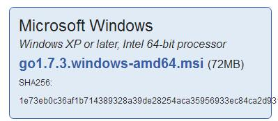
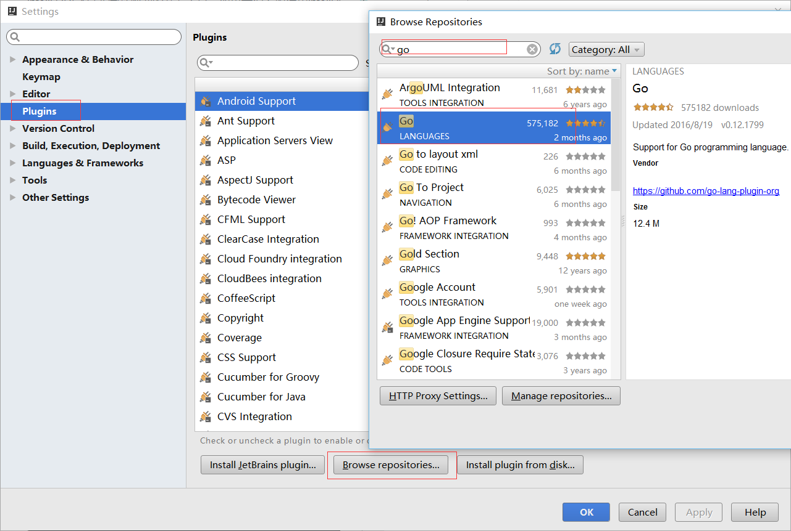
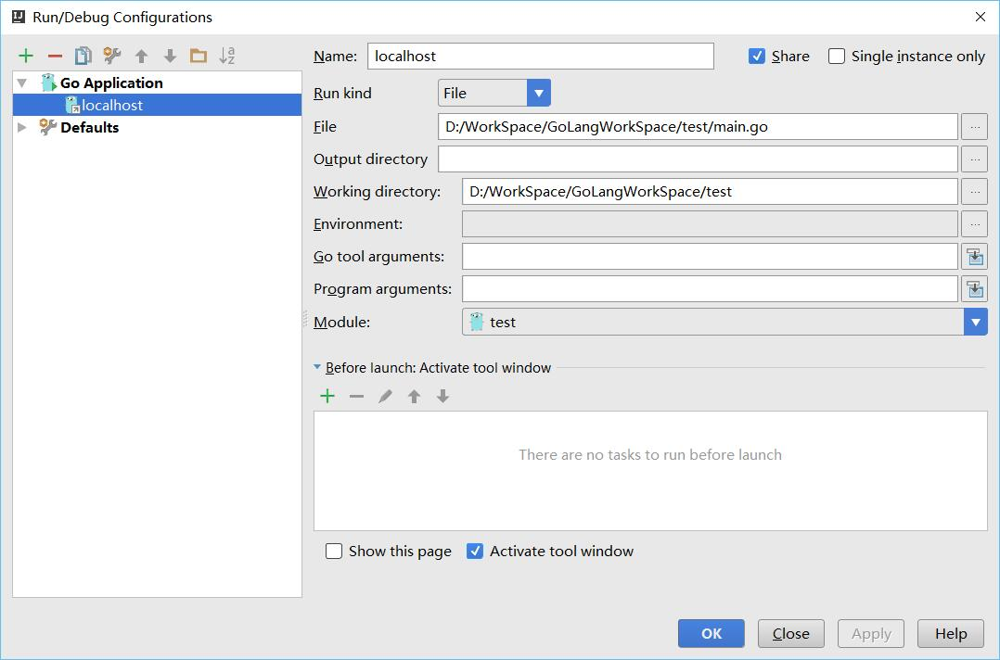
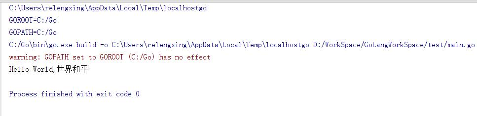
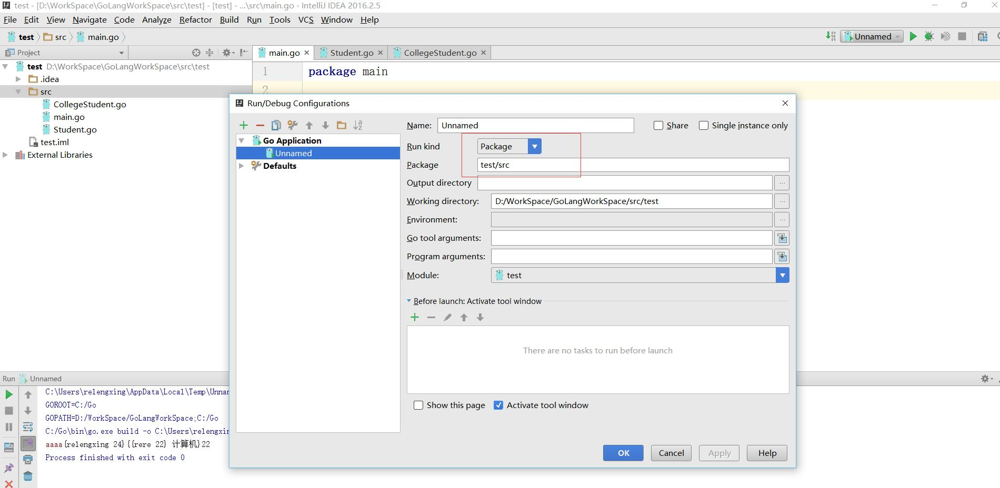

# Golang学习
作者：re冷星
QQ：670656469
日期：2016/11/2

##开发环境的安装
这一块我也不是很懂，版本选择和ide的选择仁者见仁智者见智。
我是安装的最新版的go,也就是1.7.3版本
ide是IntelliJ IDEA 2016.2.5，也不是最方便的，还是有很多蛋疼的地方。

安装Golang的话就是在[Go官网](https://golang.org/dl/)自己Download
windows下是一个msi的文件

装在哪都行，装好以后我的电脑是不用配置什么的，如果你的电脑要设置什么的话，我也无能为力。。
IntelliJ IDEA自行安装和破解，我这里的破解也不是完整破解，好像只能用到2017年2月。
idea安装go

安装好后重启，新建工程
idea有个很蛋疼的地方，就是每次换一个工程的时候要重新设置Edit Configurations
设置成如图这样就行了，有两个条件package main ,包含main方法


hello world的代码如下：
```go
package main

import "fmt"

func main() {
    str := "Hello World,世界和平"
    fmt.Println(str)
}
```




这一篇的安装环境是有点坑的。
自己还不怎么会，也是按照网上的教程配置的，然后软件这东西经常变，主要是多尝试。

能运行起来就是好事，然后就是可以开始进一步的学习的。

****
****
****
<font color="red" size="24">这里是后来补充的</font>
我的idea在使用时候有遇到一些问题，比如backspace和insert这两个键的问题，如果遇到了应该能看懂，看不懂说明没遇到，我要恭喜你。这里是据说是一个vim插件的问题，进plugin里面搜索vim，然后把那个插件禁用掉就可以了。


还有在做面向对象的时候，我把Student这个结构体放在一个同文件夹下，package名字相同都是main,但是main里面无法调用，我记得原因是main.go编译了，但是Student.go没编译。这里因为我做过很多操作，也不知道具体是哪条有用。我觉得应该是这样，看下图，照着改一下。如果不行可能和GOPATH有关，这个在环境变量里设置一下，我的工程目录是放在$GOPATH/src下面的。我这里就提供一个方向。如果有人遇到和我一样的问题，可以往这个方向试试

