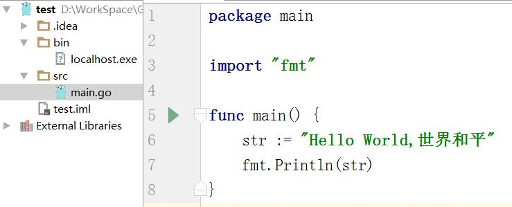
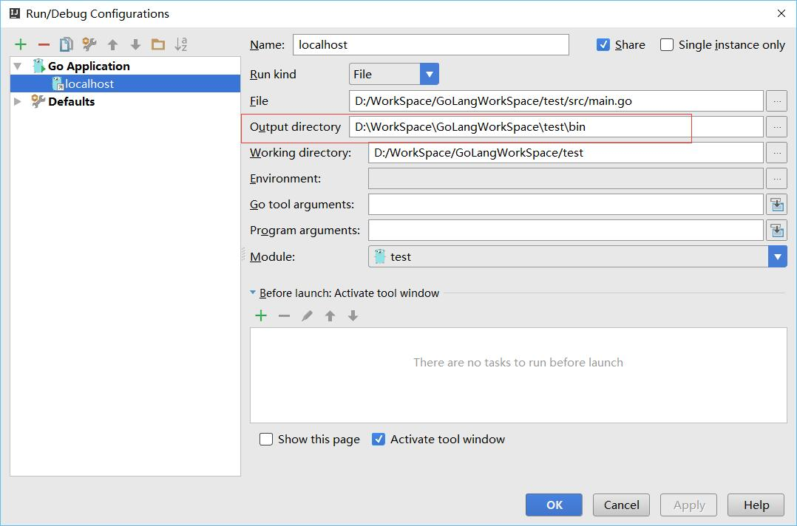

# Golang学习：第一个程序
## 代码解读
上一篇主要是为了确认自己的电脑能够运行Golang程序    
文明一点讲就是:如果HelloWorld都运行不起来，那还写~~丁日~~什么  
注意:可以不用写';了
```go
package main

import "fmt"// 我们需要使用fmt包中的Println()函数

func main() {

    fmt.Println("Hello, world. 你好，世界！ ")

}
```

以下引用内容来自《Go语言编程》
>每个Go源代码文件的开头都是一个package声明，表示该Go代码所属的包。包是Go语言里
最基本的分发单位，也是工程管理中依赖关系的体现。要生成Go可执行程序，必须建立一个名
字为main的包，并且在该包中包含一个叫main()的函数（该函数是Go可执行程序的执行起点）。

>在包声明之后，是一系列的import语句，用于导入该程序所依赖的包。

>有一点需要注意，不得包含在源代码文件中没有用到的包，否则Go编译器会报编译错误。
这与下面提到的强制左花括号{的放置位置以及之后会提到的函数名的大小写规则，均体现了Go
语言在语言层面解决软件工程问题的设计哲学。

>所有Go函数（包括在对象编程中会提到的类型成员函数）以关键字func开头。一个常规的
函数定义包含以下部分：
```go
func 函数名(参数列表)(返回值列表) {
// 函数体
}
//对应的一个实例如下：
func Compute(value1 int, value2 float64)(result float64, err error) {
// 函数体
}
```

>Go支持多个返回值。以上的示例函数Compute()返回了两个值，一个叫result，另一个是
err。并不是所有返回值都必须赋值

## 工程管理
这里做一个最简单的，初步具备一个工程的雏形，以后随着做的东西复杂起来了再慢慢完善

就建两个文件夹，一个bin用于生成可执行文件，一个src用于装源文件  
.diea和test.iml是idea自动生成的，可以不用管它
运行配置如下图，把file改一下，output directory改一下

