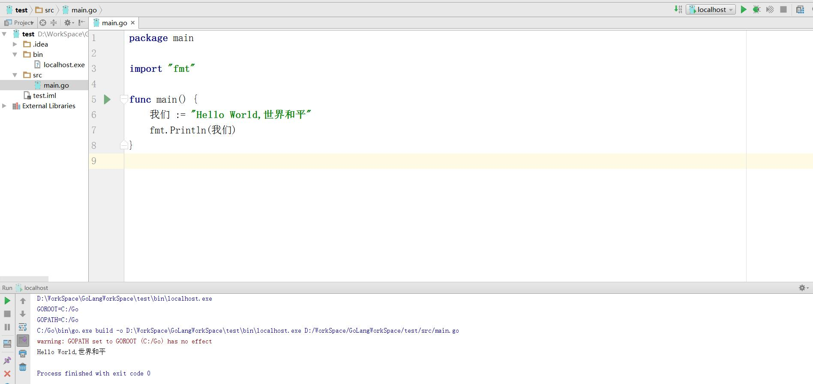

# Golang学习：数据类型
这个系列的博客主要是为了自己学习，做做笔记，如果有缘可能会看到
我是有2年单片机从业经验，然后会一些Android的开发者。也就是会一些C语言和JAVA
所以文章的基础也是有C和JAVA的


## 注释
与C/C++一样
```
//行注释
/*块注释*/
```
## 分号
分号作为语句终止符号，但：
**如果前一个符号是语句的结尾，那词法分析程序将自动在行尾插入一个分号**
## 标识符
  除了数字开头不允许，关键字不允许。其他的Unicode字符组合都可以。
“我们”也可以是标识符。标识符也区分大小写。
关于变量名是中文我实验了一下。。确实可以，结果如图，当然也不知道是好事还是坏事
以后写Go语言看到一堆中文变量名是一种什么感觉。。

<font color=red size=5>敲黑板，划重点</font>
* 以大写字母开头的标识符是公开的。
* 其他任何标识符都是私有的。　
* 空标识符“ _ ”是一个占位符，用于赋值操作的时候，丢弃、忽略某个值。通常这样用：    
go的方法一般会返回2个值，一个通常的返回、一个错误标识。如 fmt.Println(x)会返回2个值，一个是打印的字节数，一个是相应的error值，那么 count,_ = fmt.Println(x) 这行代码就忽略了相应的error值。

## 变量
>变量是几乎所有编程语言中最基本的组成元素。从根本上说，变量相当于是对一块数据存储
空间的命名，程序可以通过定义一个变量来申请一块数据存储空间，之后可以通过引用变量名来
使用这块存储空间。


### 变量声明
有三种声明的方式：
```go
var v1 int = 10 // 正确的使用方式1
var v2 = 10     // 正确的使用方式2，编译器可以自动推导出v2的类型
v3 := 10        // 正确的使用方式3，编译器可以自动推导出v3的类型
```
`var a int  //这是最具代表性的声明`
var好熟悉啊，javascript声明变量就是用这个，和c有点不一样，就是int(数据类型)在a(变量)后面
为什么要这样声明？
因为C语言有个很有歧义的声明
```c
int *a,b;
//和
int* a,b
```
这两个声明怎么理解。
实际上是声明了一个 `*a`和一个`b`
使用go语言这种声明就没有歧义了
当我们要做以上声明时
```go
var a,b * int
```
这样就不会有歧义了
### 变量初始化
var自动初始化的值为0，对应到具体的数据类型就是:
* bool: false
* integers: 0
* floats: 0.0
* string: ""
* pointers, functions, interfaces, slices, channels, maps: nil

### 变量赋值
变量赋值和大多数语言一样，右边赋值给'='左边
但是Golang支持多重赋值，也就是以前学C语言时候的swap问题没了，不用引入第三个变量，更不需要用指针了，只需要一句`i, j = j, i`即可
### 匿名变量
我们在使用传统的强类型语言编程时，经常会出现这种情况，即在调用函数时为了获取一个
值，却因为该函数返回多个值而不得不定义一堆没用的变量。在Go中这种情况可以通过结合使
用多重返回和匿名变量来避免这种丑陋的写法，让代码看起来更加优雅。
假 设 GetName() 函 数 的 定 义 如 下 ， 它 返 回 3 个 值 ， 分 别 为firstName 、 lastName 和nickName：
```go
func GetName() (firstName, lastName, nickName string) {
return "May", "Chan", "Chibi Maruko"
}
//若只想获得nickName，则函数调用语句可以用如下方式编写：
_, _, nickName := GetName()
```
这种用法可以让代码非常清晰，基本上屏蔽掉了可能混淆代码阅读者视线的内容，从而大幅
降低沟通的复杂度和代码维护的难度。

## 常量
以下内容都来自《Go语言编程》，由于对常量不知道写什么，又不能不写，直接复制了。
### 字面常量
所谓字面常量（literal），是指程序中硬编码的常量，如：
```go
-12
3.14159265358979323846 // 浮点类型的常量
3.2+12i // 复数类型的常量
true // 布尔类型的常量
"foo" // 字符串常量
```
在其他语言中，常量通常有特定的类型，比如-12在C语言中会认为是一个int类型的常量。
如果要指定一个值为-12的long类型常量，需要写成-12l，这有点违反人们的直观感觉。 Go语言
的字面常量更接近我们自然语言中的常量概念，它是无类型的。只要这个常量在相应类型的值域
范围内，就可以作为该类型的常量，比如上面的常量-12，它可以赋值给int、 uint、 int32、
int64、 float32、 float64、 complex64、 complex128等类型的变量。
### 常量定义
在Go语言中，常量是指编译期间就已知且不可改变的值。常量可以是数值类型（包括整型、
浮点型和复数类型）、布尔类型、字符串类型等。

通过const关键字，你可以给字面常量指定一个友好的名字：
```go
const Pi float64 = 3.14159265358979323846
const zero = 0.0 // 无类型浮点常量
const (
size int64 = 1024
eof = -1 // 无类型整型常量
)
const u, v float32 = 0, 3 // u = 0.0, v = 3.0，常量的多重赋值
const a, b, c = 3, 4, "foo"
// a = 3, b = 4, c = "foo", 无类型整型和字符串常量
```
常量定义的右值也可以是一个在编译期运算的常量表达式，比如
`const mask = 1 << 3`
### 预定义常量

Go语言预定义了这些常量： true、 false和iota。
iota比较特殊，可以被认为是一个可被编译器修改的常量，在每一个const关键字出现时被
重置为0，然后在下一个const出现之前，每出现一次iota，其所代表的数字会自动增1。
从以下的例子可以基本理解iota的用法：
```go
const ( // iota被重设为0
    c0 = iota // c0 == 0
    c1 = iota // c1 == 1
    c2 = iota // c2 == 2
)
const (
    a = 1 << iota // a == 1 (iota在每个const开头被重设为0)
    b = 1 << iota // b == 2
    c = 1 << iota // c == 4
)
const (
    u = iota * 42 // u == 0
    v float64 = iota * 42 // v == 42.0
    w = iota * 42 // w == 84
)
const x = iota // x == 0 (因为iota又被重设为0了)
const y = iota // y == 0 (同上)
```
如果两个const的赋值语句的表达式是一样的，那么可以省略后一个赋值表达式。因此，上
面的前两个const语句可简写为：
```go
const ( // iota被重设为0
    c0 = iota // c0 == 0
    c1 // c1 == 1
    c2 // c2 == 2
)
const (
    a = 1 <<iota // a == 1 (iota在每个const开头被重设为0)
    b // b == 2
    c // c == 4
)
```
### 枚举
枚举指一系列相关的常量，比如下面关于一个星期中每天的定义。通过上一节的例子，我们
看到可以用在const后跟一对圆括号的方式定义一组常量，这种定义法在Go语言中通常用于定义
枚举值。 Go语言并不支持众多其他语言明确支持的enum关键字。
下面是一个常规的枚举表示法，其中定义了一系列整型常量：
```go
const (
    Sunday = iota
    Monday
    Tuesday
    Wednesday
    Thursday
    Friday
    Saturday
    numberOfDays // 这个常量没有导出
)
```
同Go语言的其他符号（symbol）一样，以大写字母开头的常量在包外可见。
以上例子中numberOfDays为包内私有，其他符号则可被其他包访问
## 数据类型
Go语言内置以下这些基础类型：
* 布尔类型： bool。
* 整型： int8、 byte、 int16、 int、 uint、 uintptr等。
* 浮点类型： float32、 float64。
* 复数类型： complex64、 complex128。
* 字符串： string
* 字符类型： rune。
* 错误类型： error。
此外， Go语言也支持以下这些复合类型：
* 指针（pointer）
* 数组（array）
* 切片（slice）
* 字典（map）
* 通道（chan）
* 结构体（struct）
* 接口（interface）

go的数据类型很好记
int8,int16,int32,int64,如果有符号就在前面加u,分别代表8,16,32,64位二进制数
单独的int是根据你机器来判断的
这里我们只要记住认识的就行了，不认识的就不管
我就认识布尔、整形、浮点型、字符串、指针、数组、结构体、接口、切面（学过几天python）
### 布尔类型
布尔类型的关键字:`bool`,可赋值为预定义的`true`和`false`
下面这段是在源码中看到的，可以理解下
```go
// true and false are the two untyped boolean values.
const (
	true  = 0 == 0 // Untyped bool.
	false = 0 != 0 // Untyped bool.
)
```
布尔类型不能接受其他类型的赋值，不支持自动或强制的类型转换。
以下的示例是一些错误的用法，会导致编译错误：
```go
var b bool
b = 1 // 编译错误
b = bool(1) // 编译错误
```
以下的用法才是正确的：
```go
var b bool
b = (1!=0) // 编译正确
fmt.Println("Result:", b) // 打印结果为Result: true
```
### 整形
|类 型 |长度（字节）| 值 范 围|
|:-------|:-------|:-------|
|int8| 1| -128 ~ 127|
|uint8|（即byte） 1 |0 ~ 255|
|int16 |2 |-32 768 ~ 32 767|
|uint16| 2 |0 ~ 65 535|
|int32 |4 |-2 147 483 648 ~ 2 147 483 647|
|uint32| 4| 0 ~ 4 294 967 295|
|int64 |8 |-9 223 372 036 854 775 808 ~ 9 223 372 036 854 775 807|
|uint64 |8| 0 ~ 18 446 744 073 709 551 615|
|int| 平台相关 |平台相关|
|uint|平台相关| 平台相关|
|uintptr| 同指针| 在32位平台下为4字节， 64位平台下为8字节|

需要注意的是， int和int32在Go语言里被认为是两种不同的类型，编译器也不会帮你自动
做类型转换

数值运算和C语言一样
比较运算也和C语言一样
注意:两个不同类型的整型数不能直接比较，比如int8类型的数和int类型的数不能直接比较，但
各种类型的整型变量都可以直接与字面常量（literal）进行比较
#### 位运算
例
|运 算| 含 义| 样 例|
|:------|:------|:------|
|x << y| 左移 |124 << 2 // 结果为496|
|x >> y| 右移| 124 >> 2 // 结果为31|
|x ^ y| 异或 |124 ^ 2 // 结果为126|
|x & y |与| 124 & 2 // 结果为0|
|^x 取反 |^2 |// 结果为-3|
<font color=red>Golang的取反是`^`不是C语言的`~`</font>
### 浮点型
Golang的浮点型有两种
`float32`和`float64`
对应C语言的`float`和`double`
自动赋值会被赋值为`float64`的类型

#### 浮点数比较
因为浮点数不是一种精确的表达方式，所以像整型那样直接用==来判断两个浮点数是否相等
是不可行的，这可能会导致不稳定的结果。
下面是一种推荐的替代方案：
```go
import "math"
// p为用户自定义的比较精度，比如0.00001
func IsEqual(f1, f2, p float64) bool {
return math.Fdim(f1, f2) < p
}
```
### 复数类型
复数实际上由两个实数（在计算机中用浮点数表示）构成，一个表示实部（real），一个表示
虚部（imag）。如果了解了数学上的复数是怎么回事，那么Go语言的复数就非常容易理解了。
1. 复数表示
复数表示的示例如下：
var value1 complex64 // 由2个float32构成的复数类型
value1 = 3.2 + 12i
value2 := 3.2 + 12i // value2是complex128类型
value3 := complex(3.2, 12) // value3结果同 value2
2. 实部与虚部
对于一个复数z = complex(x, y)，就可以通过Go语言内置函数real(z)获得该复数的实
部，也就是x，通过imag(z)获得该复数的虚部，也就是y。
更多关于复数的函数，请查阅math/cmplx标准库的文档
### 字符串
go的字符串是基本数据类型
使用`+`来连接字符串，例如：`str1+str2`
可以使用len()函数来计算长度，例如：`len(str)`
使用下表来取字符，例如：`str[2]`
字符串是常量，不能通过下标的方式进行修改
更多字符串操作参考标准库 strings 包

#### 字符串遍历
1. 使用for循环
```go
str := "Hello,世界"
n := len(str)
for i := 0; i < n; i++ {
    ch := str[i] // 依据下标取字符串中的字符，类型为byte
    fmt.Println(i, ch)
}
```
2. 另一种是以Unicode字符遍历：
```go
str := "Hello,世界"
for i, ch := range str {
    fmt.Println(i, ch)//ch的类型为rune
}
```

### 字符类型

在Go语言中支持两个字符类型，一个是byte（实际上是uint8的别名），代表UTF-8字符串的单个字节的值；另一个是rune，代表单个Unicode字符。
关于rune相关的操作，可查阅Go标准库的unicode包。另外unicode/utf8包也提供了UTF8和Unicode之间的转换。
出于简化语言的考虑， Go语言的多数API都假设字符串为UTF-8编码。尽管Unicode字符在标准库中有支持，但实际上较少使用。

### 数组
数组没什么好说的，就看一些示例即可：
```go
以下为一些常规的数组声明方法：
[32]byte // 长度为32的数组，每个元素为一个字节
[2*N] struct { x, y int32 } // 复杂类型数组
[1000]*float64 // 指针数组
[3][5]int // 二维数组
[2][2][2]float64 // 等同于[2]([2]([2]float64))
```
强调一点：在Go语言中数组是一个值类型（value type）。所有的值类型变量在赋值和作为参数传递时都将产生一次复制动作。如果将数组作为函数的参数类型，则在函数调用时该参数将发生数据复制。因此，在函数体中无法修改传入的数组的内容，因为函数内操作的只是所传入数组的一个副本。
在C语言中，数组作为函数参数时是会退化成一个指针的。
