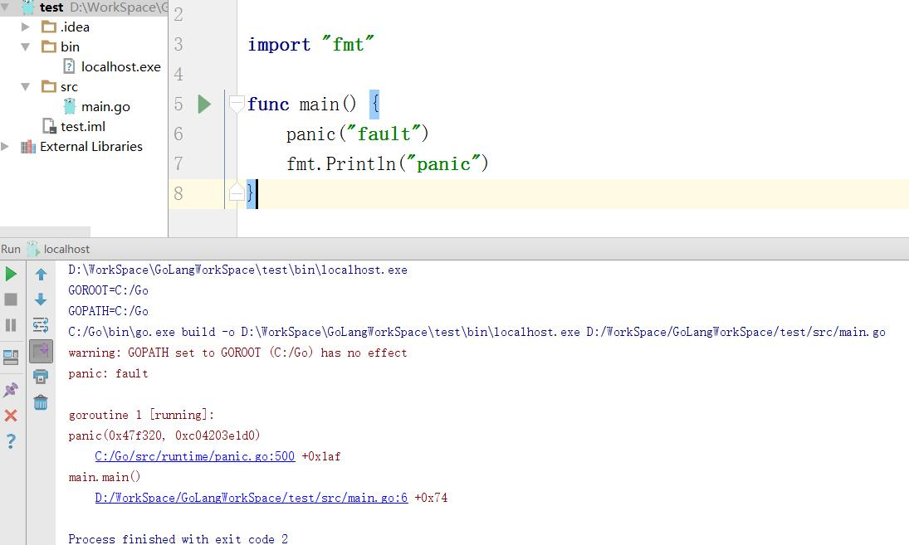
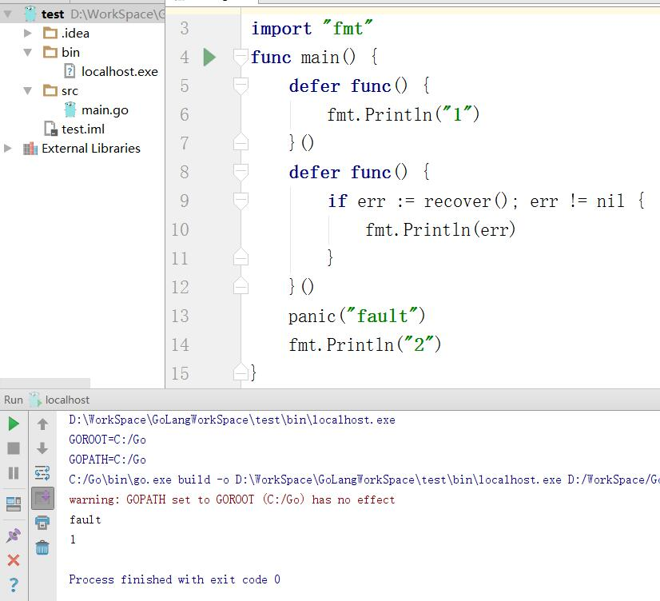

# Golang学习：错误处理

做C语言的时候没注意过异常处理，JAVA的try-catch倒是深入人心
这篇学习Go的异常处理
## error接口
接口的定义如下，只要实现Error这个函数就实现了这个接口
```go
type error interface {
Error() string
}
```
对于大多数函数，如果要返回错误，大致上都可以定义为如下模式，将error作为多种返回
值中的最后一个，但这并非是强制要求：
```go
func Foo(param int)(n int, err error) {
// ...
}
```
调用时的代码建议按如下方式处理错误情况：
```go
n, err := Foo(0)
if err != nil {
// 错误处理
} else {
// 使用返回值n
}
```
## defer
defer是一个延迟函数
defer声明时不会立即执行，而是在函数return后再按FILO(first in last out，先进后出)的原则依次执行每一个defer。一般用于异常处理、释放资源、清理数据、记录日志等，这有点像C++的析构函数。
经典案例：
```go
func CopyFile(dst, src string) (w int64, err error) {
    srcFile, err := os.Open(src)
    if err != nil {
        return
    }
    defer srcFile.Close() //每次申请资源时，请习惯立即申请一个 defer 关闭资源，这样就不会忘释放资源了
    dstFile, err := os.Create(dst)
    if err != nil {
        return
    }
    defer dstFile.Close()
    return io.Copy(dstFile, srcFile)
}
```
如果觉得一句话干不完清理的工作，也可以使用在defer后加一个匿名函数的做法：
```go
defer func() {
// 做你复杂的清理工作
} ()
```
##  panic()和recover()
golang中没有try... catch...，所以当golang中遇到panic时，如果不进行recover，便会导致整个程序挂掉，具体例子如下：


解决办理：利用defer延迟处理的recover进行恢复，具体例子如下：


程序首先运行panic，出现故障，此时跳转到包含recover()的defer函数执行，recover捕获panic，此时panic就不继续传递．但是recover之后，程序并不会返回到panic那个点继续执行以后的动作，而是在recover这个点继续执行以后的动作，即执行上面的defer函数，输出１.
注意：利用recover处理panic指令，必须利用defer在panic之前声明，否则当panic时，recover无法捕获到panic，无法防止panic扩散．
