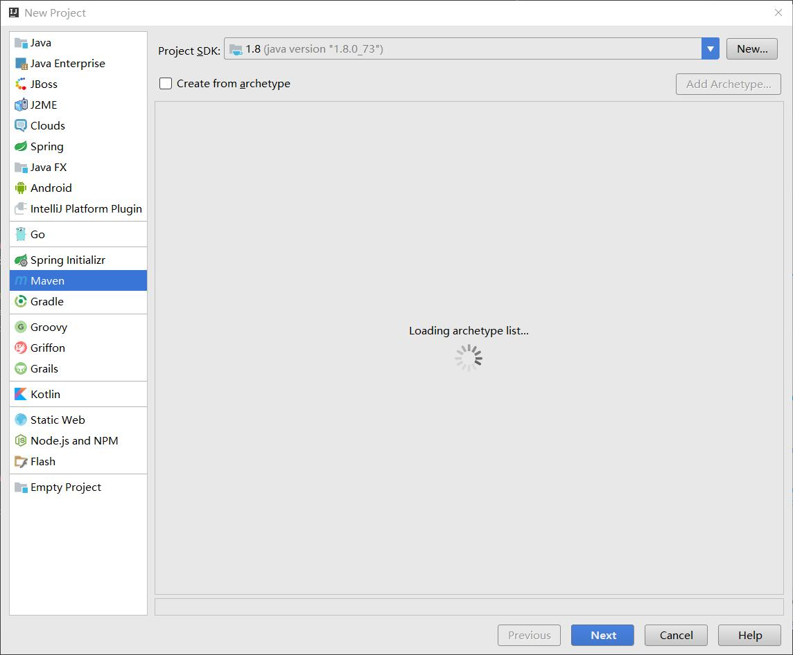
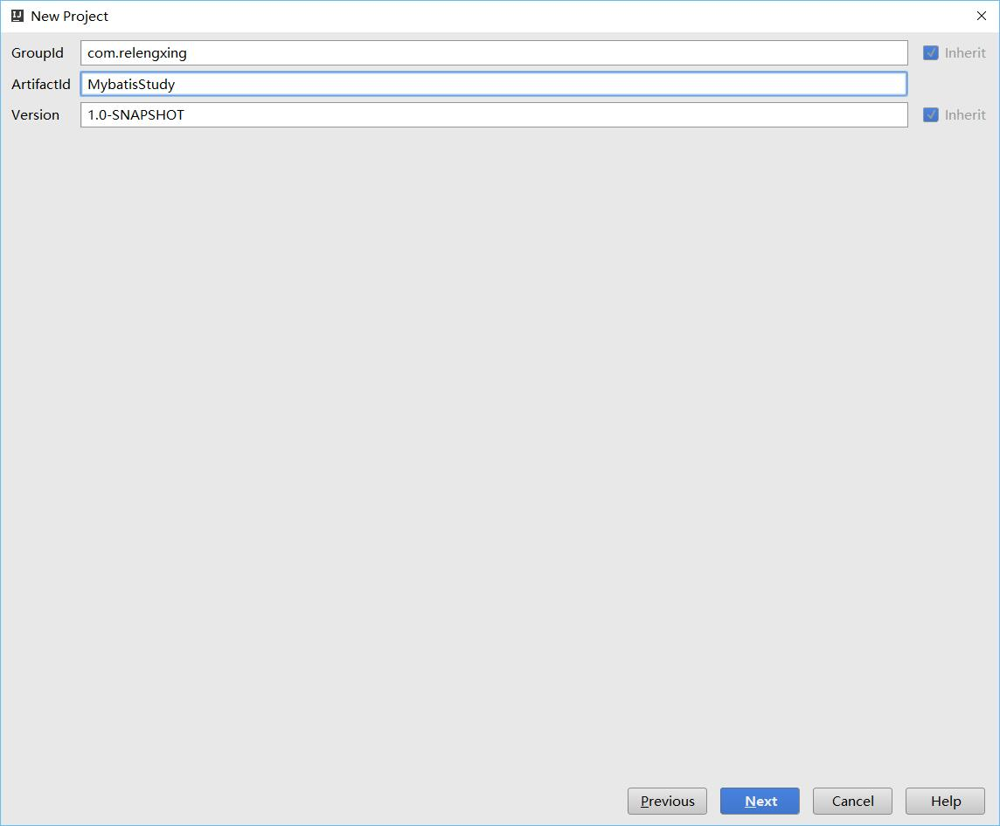
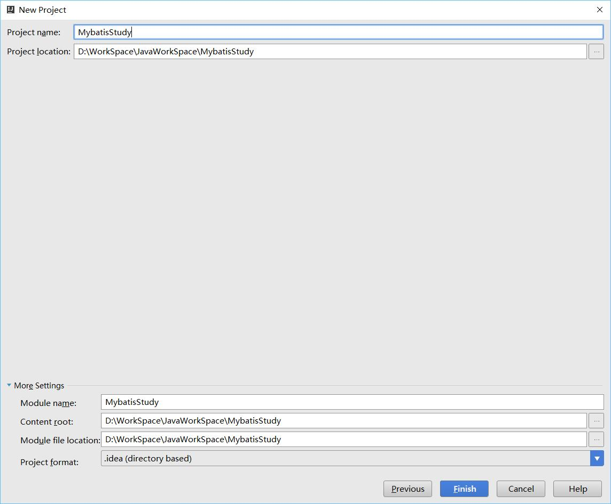
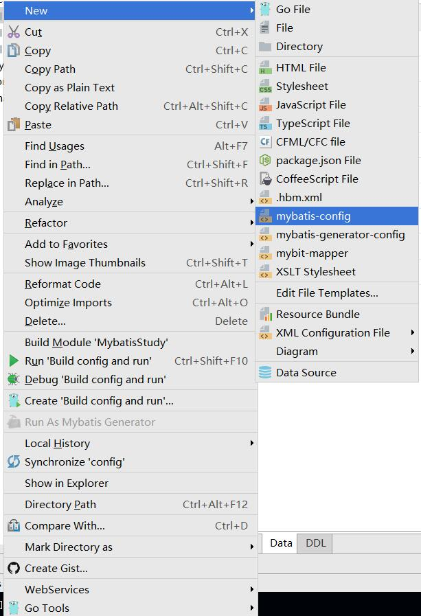
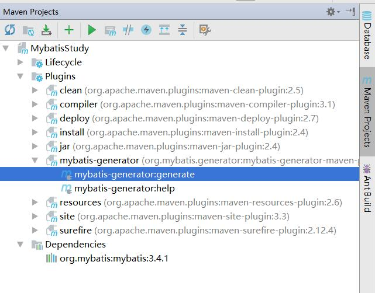
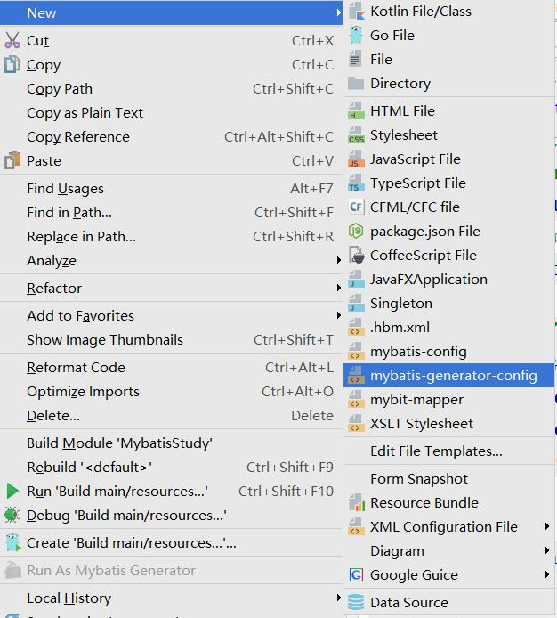

# Mybatis学习笔记：HelloWorld


## 新建工程





修改POM
```xml
    <dependencies>
        <dependency>
            <groupId>org.mybatis</groupId>
            <artifactId>mybatis</artifactId>
            <version>3.4.1</version>
        </dependency>
        <dependency>
            <groupId>mysql</groupId>
            <artifactId>mysql-connector-java</artifactId>
            <version>5.1.40</version>
        </dependency>
    </dependencies>
    <build>
        <plugins>
            <plugin>
                <groupId>org.mybatis.generator</groupId>
                <artifactId>mybatis-generator-maven-plugin</artifactId>
                <version>1.3.5</version>
            </plugin>
        </plugins>
    </build>
```
添加配置文件

配置如下
```xml
<?xml version="1.0" encoding="UTF-8"?>
<!DOCTYPE configuration
        PUBLIC "-//mybatis.org//DTD Config 3.0//EN"
        "http://mybatis.org/dtd/mybatis-3-config.dtd">
<configuration>

    <properties resource="jdbc.properties"></properties>
    <settings>
        <!-- Globally enables or disables any caches configured in any mapper under this configuration -->
        <setting name="cacheEnabled" value="true"/>
        <!-- Sets the number of seconds the driver will wait for a response from the database -->
        <setting name="defaultStatementTimeout" value="3000"/>
        <!-- Enables automatic mapping from classic database column names A_COLUMN to camel case classic Java property names aColumn -->
        <setting name="mapUnderscoreToCamelCase" value="true"/>
        <!-- Allows JDBC support for generated keys. A compatible driver is required.
        This setting forces generated keys to be used if set to true,
         as some drivers deny compatibility but still work -->
        <setting name="useGeneratedKeys" value="true"/>
    </settings>
    <!-- Continue going here -->
    <environments default="development">
        <environment id="development">
            <transactionManager type="JDBC"/>
            <dataSource type="POOLED">
                <property name="driver" value="${jdbc.driver}"/>
                <property name="url" value="${jdbc.url}"/>
                <property name="username" value="${jdbc.username}"/>
                <property name="password" value="${jdbc.password}"/>
            </dataSource>
        </environment>
    </environments>
    <mappers>
        <mapper resource="mapper/UserMapper.xml"/>
        <mapper resource="mapper/ItemsMapper.xml"/>
        <mapper resource="mapper/OrderdetailMapper.xml"/>
        <mapper resource="mapper/OrdersMapper.xml"/>
    </mappers>
</configuration>
```
需要修改的地方看着改一下
有一个常量配置文件jdbc.properties
```properties
jdbc.driver=com.mysql.jdbc.Driver
jdbc.url=jdbc:mysql://localhost:3306/mybatis?characterEncoding=utf-8
jdbc.username=root
jdbc.password=1234
```
然后我们想要根据数据库直接生成实体类和实体类的一些相关东西，需要使用前面添加的一个插件

使用插件之前需要一个配置文件

代码如下
```xml
<?xml version="1.0" encoding="UTF-8" ?>
<!DOCTYPE generatorConfiguration PUBLIC
        "-//mybatis.org//DTD MyBatis Generator Configuration 1.0//EN"
        "http://mybatis.org/dtd/mybatis-generator-config_1_0.dtd" >
<generatorConfiguration>
    <!-- !!!! Driver Class Path !!!! -->
    <classPathEntry location="C:\Users\relengxing\.m2\repository\mysql\mysql-connector-java\5.1.40\mysql-connector-java-5.1.40.jar"/>

    <context id="context" targetRuntime="MyBatis3">
        <commentGenerator>
            <property name="suppressAllComments" value="false"/>
            <property name="suppressDate" value="true"/>
        </commentGenerator>

        <!-- !!!! Database Configurations !!!! -->
        <jdbcConnection driverClass="com.mysql.jdbc.Driver"
                        connectionURL="jdbc:mysql://localhost:3306/mybatis"
                        userId="root"
                        password="1234"/>

        <javaTypeResolver>
            <property name="forceBigDecimals" value="false"/>
        </javaTypeResolver>

        <!-- !!!! Model Configurations !!!! -->
        <javaModelGenerator targetPackage="com.relengxing.bean"
                            targetProject="src/main/java">
            <property name="enableSubPackages" value="false"/>
            <property name="trimStrings" value="true"/>
        </javaModelGenerator>

        <!-- !!!! Mapper XML Configurations !!!! -->
        <sqlMapGenerator targetPackage="mapper"
                         targetProject="src/main/resources">
            <property name="enableSubPackages" value="false"/>
        </sqlMapGenerator>

        <!-- !!!! Mapper Interface Configurations !!!! -->
        <javaClientGenerator targetPackage="com.relengxing.mapper"
                             targetProject="src/main/java"
                             type="XMLMAPPER">
            <property name="enableSubPackages" value="true"/>
        </javaClientGenerator>

        <!-- !!!! Table Configurations !!!! -->
        <table tableName="items" enableCountByExample="false" enableDeleteByExample="false"
               enableSelectByExample="false"
               enableUpdateByExample="false"/>
        <table tableName="orders" enableCountByExample="false" enableDeleteByExample="false"
               enableSelectByExample="false"
               enableUpdateByExample="false"/>
        <table tableName="orderdetail" enableCountByExample="false" enableDeleteByExample="false"
               enableSelectByExample="false"
               enableUpdateByExample="false"/>
        <table tableName="user" enableCountByExample="false" enableDeleteByExample="false"
               enableSelectByExample="false"
               enableUpdateByExample="false"/>
    </context>
</generatorConfiguration>
```
也是自己看着改一下，不要复制，location是一个jdbc的驱动包的位置
然后就可以执行插件生成了。

