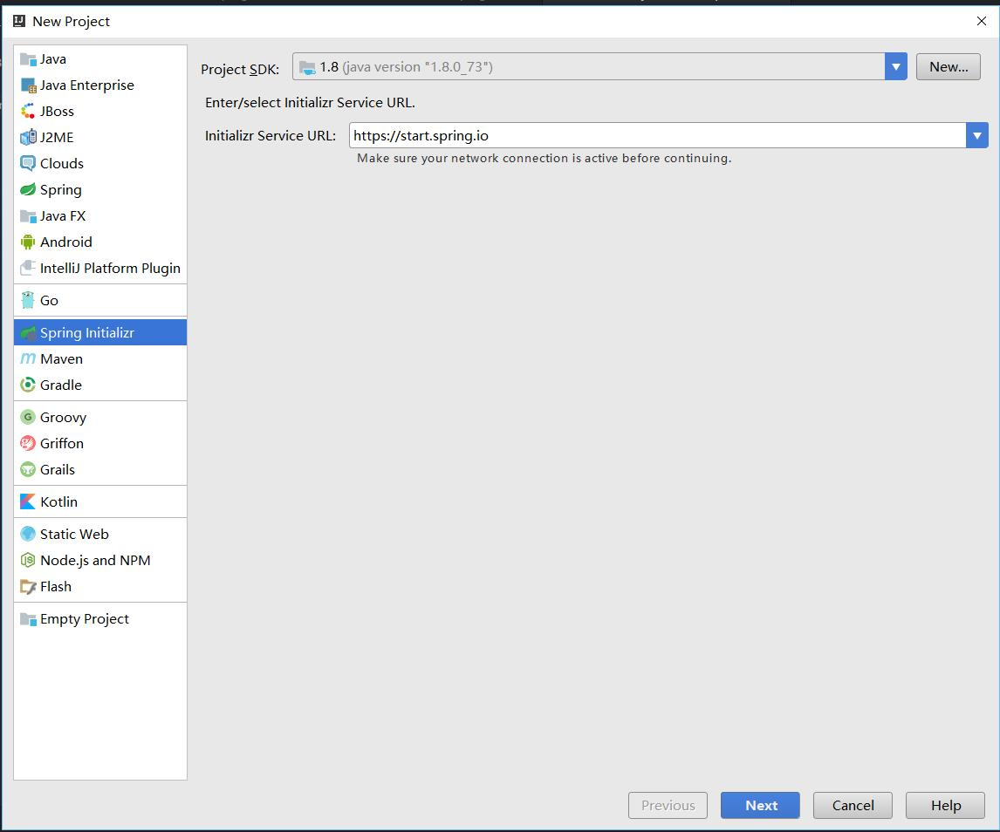
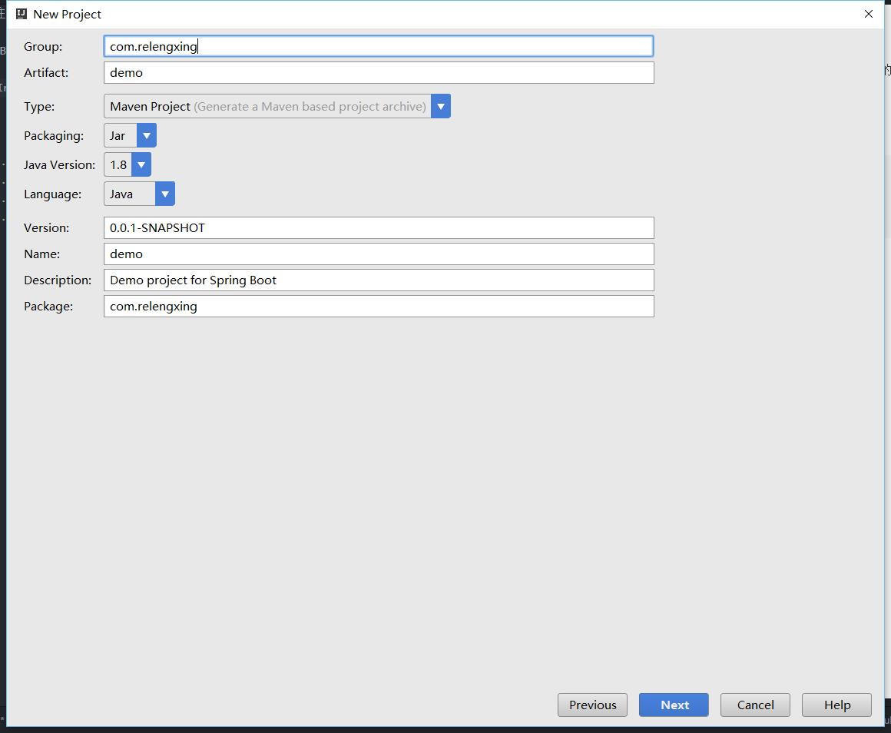
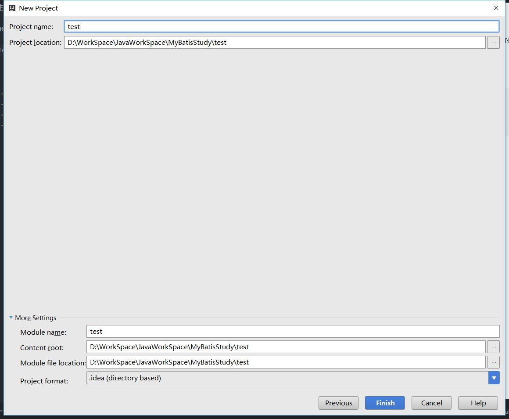

Mybatis学习笔记：注解版

最近一直在用SpringBoot，以后都用注解版，研究一下Mybatis注解版的开发。

这一篇只写普通查询，一对一，一对多，多对多

增删改暂时不写

使用idea的Spring Initializr创建工程







### 数据库配置
```
spring.datasource.url=jdbc:mysql://localhost:3306/mybatis
spring.datasource.username=root
spring.datasource.password=1234
spring.datasource.driver-class-name=com.mysql.jdbc.Driver
```
一对一和普通查询部分代码
```java
@Mapper
public interface StudentDao {

    @Select("SELECT * FROM student where id=#{id}")
    @Results({
            @Result(property = "classes",column = "class_id",one = @One(select = "com.relengxing.mapper.ClassesDao.findById"))
    })
    Student findById(@Param("id")int id);

    @Select("SELECT * FROM student WHERE class_id=#{classid}")
    List<Student> findByClassId(@Param("classid")int classid);
}
```
一对多部分代码
```java
@Mapper
public interface ClassesDao {

    @Select("SELECT * FROM classes where id=#{id}")
    @Results({
            @Result(id = true,property = "id",column = "id"),
            @Result(property = "name",column = "name"),
            @Result(property = "teacher",column = "teacher_id",one = @One(select = "com.relengxing.mapper.TeacherDao.findById")),
            @Result(property = "students",column = "id",many = @Many(select = "com.relengxing.mapper.StudentDao.findByClassId"))
    })
    Classes findById(@Param("id")int id);
}
```

多对多原则上就是拆分成多个一对多，所以还是参考上面的代码，主要是一种写法。其他的没什么。
照着写就可以了。
