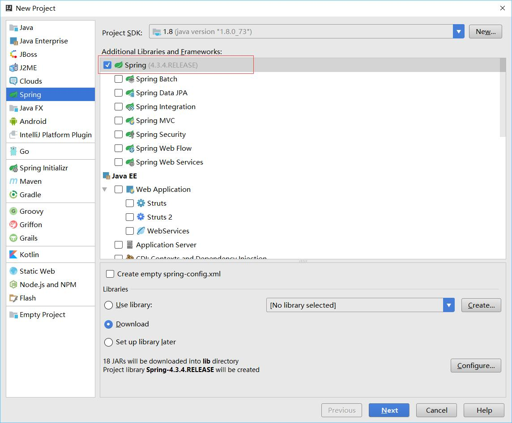
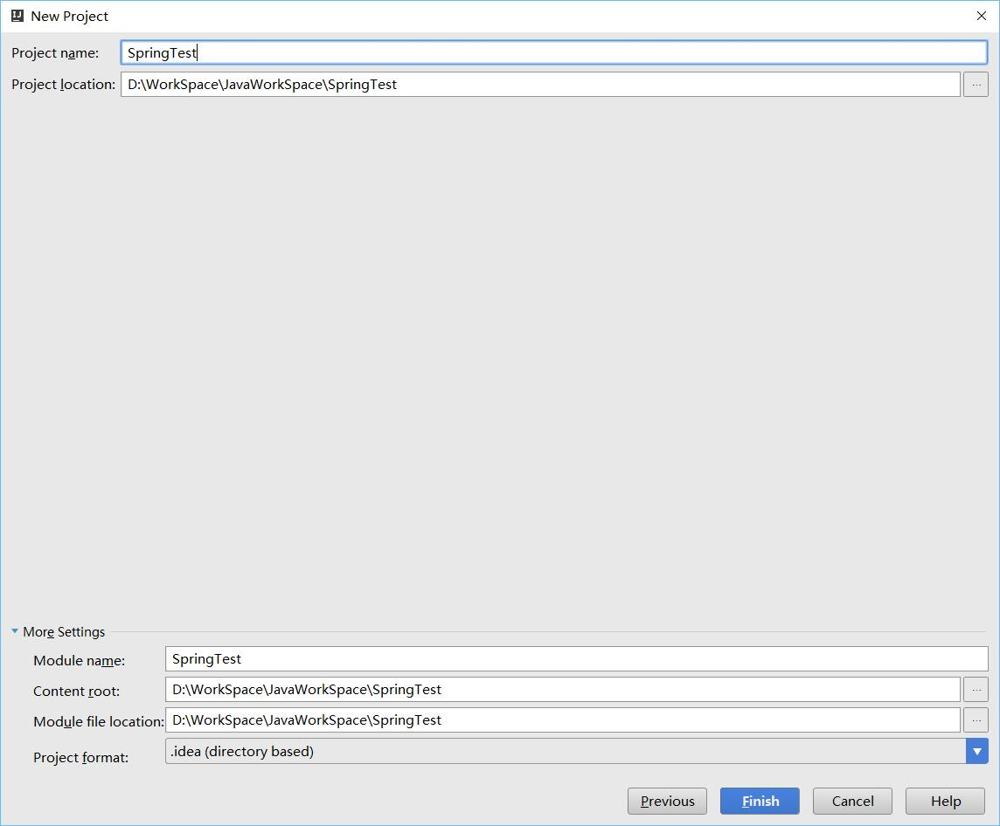
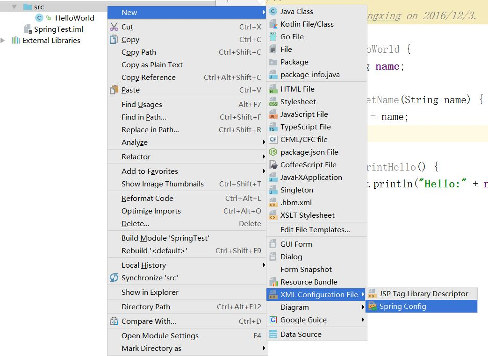

# Spring学习笔记：HelloWorld

这篇主要写开发环境，然后是一个简单的HelloWorld
环境：win10x64
jdk1.8
intelliJ Idea2016.3

## 新建工程
如图：



新建一个bean类叫HelloWorld,代码如下
```java
public class HelloWorld {
    private String name;

    public void setName(String name) {
        this.name = name;
    }

    public void printHello() {
        System.out.println("Hello:" + name);
    }
}
```
新建一个配置文件applicationContext.xml

```xml
<?xml version="1.0" encoding="UTF-8"?>
<beans xmlns="http://www.springframework.org/schema/beans"
       xmlns:xsi="http://www.w3.org/2001/XMLSchema-instance"
       xsi:schemaLocation="http://www.springframework.org/schema/beans http://www.springframework.org/schema/beans/spring-beans.xsd">
    <bean id="helloBean" class="HelloWorld">
        <property name="name" value="relengxing" />
    </bean>
</beans>
```
新建App.java文件
```java
import org.springframework.context.ApplicationContext;
import org.springframework.context.support.ClassPathXmlApplicationContext;

/**
 * Created by relengxing on 2016/12/3.
 */
public class App {
        public static void main(String[] args) {
            ApplicationContext context = new ClassPathXmlApplicationContext(
                    "applicationContext.xml");
            HelloWorld obj = (HelloWorld) context.getBean("helloBean");
            obj.printHello();
    }
}
```
运行，输出结果
```
Hello:relengxing
```
用idea做是比较简单的，很多东西不用自己去做，包括下载jar文件这些ide都帮忙搞定了，新建一些相关的东西也有模版，把更多的时间集中在代码上，去做更多有意义的事情。。去感受生命的美好。。
从这个例子可以看出Spring的几个作用
一个就是依赖注入，可以很方便的通过配置文件修改要注入的内容。
还有IOC（控制反转）我们的bean文件不是又自己生成的，是又Spring框架来管理，等到我们要用的时候从框架取一个。
