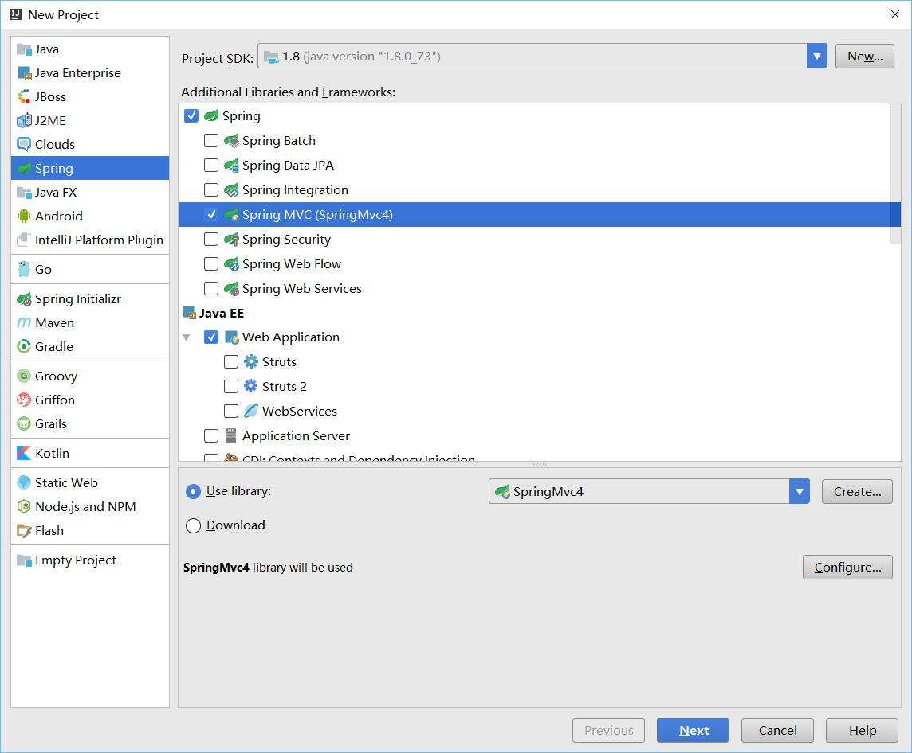
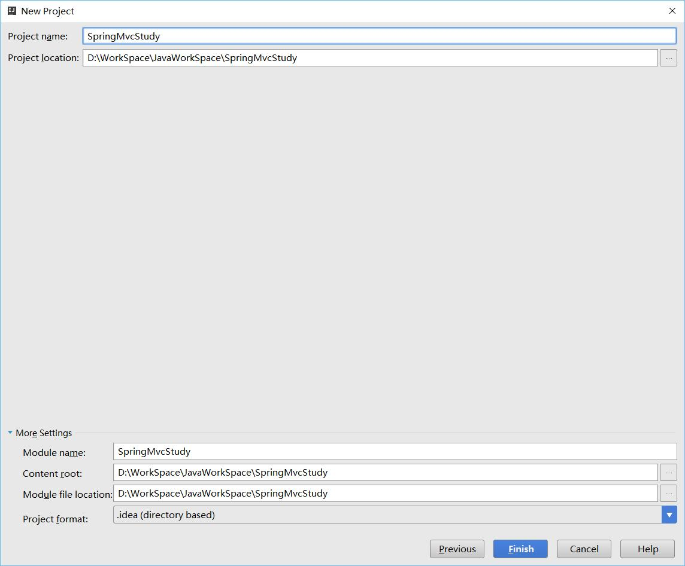
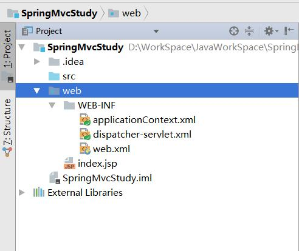
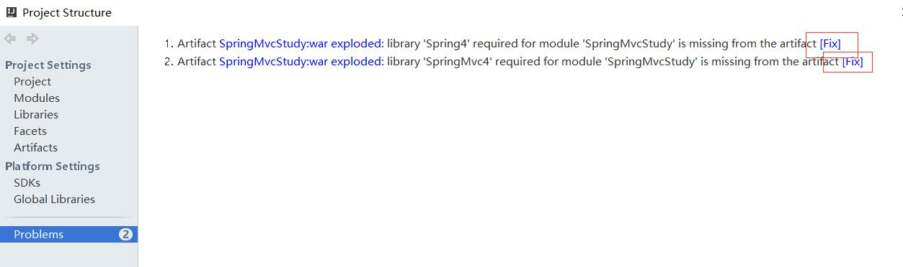
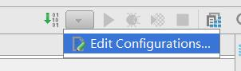
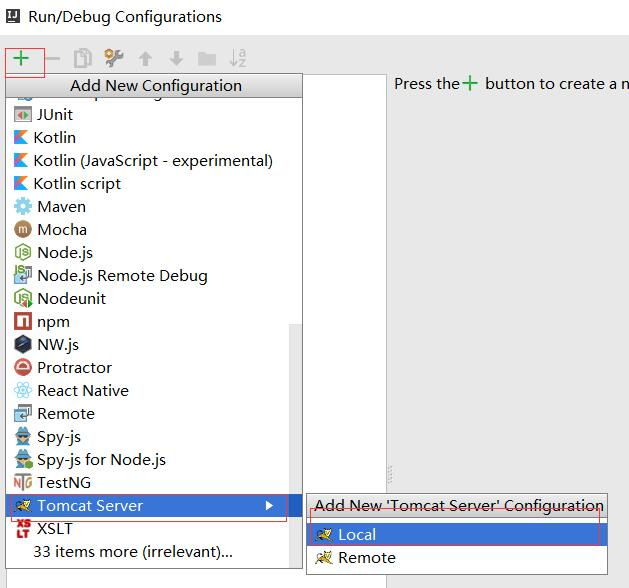
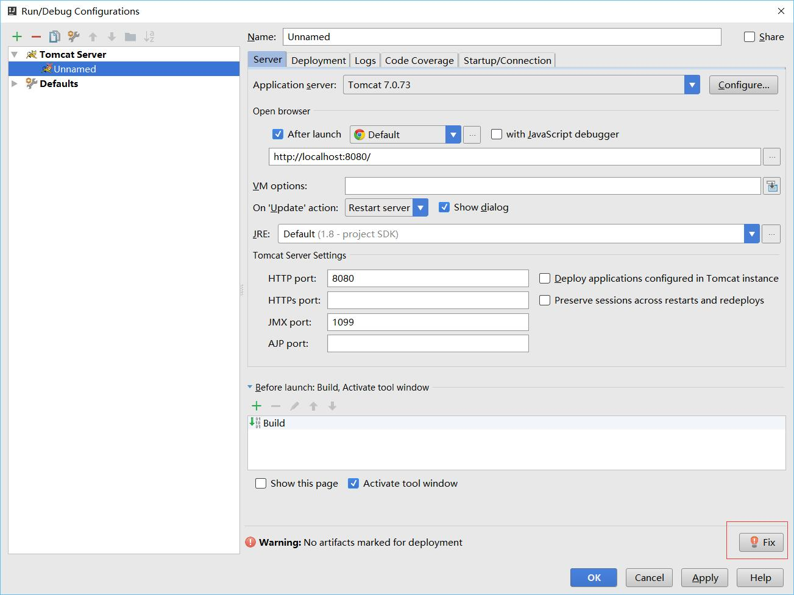

# SpringMvc学习笔记：HelloWorld

这篇讲新建工程，开发环境依旧是:
win10 x64,
jdk 1.8,
intellij idea 2016.3

## 新建工程
在idea中新建SpringMvc项目是很简单的，两步


然后就创建了如下的工程目录


在WEB-INF目录下创建一个page的文件夹，在page文件夹下创建一个hello.jsp的文件
内容如下:
```jsp
<%@ page contentType="text/html;charset=UTF-8" language="java" %>
<html>
<head>
    <title>Hello</title>
</head>
<body>
    我是Hello页面，测试成功。
</body>
</html>
```
创建一个HelloController的java文件
代码如下:
```java
package com.relengxing;

import org.springframework.stereotype.Controller;
import org.springframework.web.bind.annotation.RequestMapping;

/**
 * Created by relengxing on 2016/12/14.
 */
@Controller
public class HelloController {

    @RequestMapping("/hello")
    public String hello(){
        return "hello";
    }
}
```

接下来就是修改配置文件了
首先是web.xml文件
文件中的内容都是创建工程的时候自动创建的
只需要修改一行即可
```xml
<url-pattern>*.form</url-pattern>
```
改成
```xml
<url-pattern>/</url-pattern>
```
然后是dispatcher-servlet.xml,添加如下内容即可
```xml
    <context:component-scan base-package="com.relengxing"/>
    <context:annotation-config/>
    <bean class="org.springframework.web.servlet.view.InternalResourceViewResolver">
        <property name="prefix" value="/WEB-INF/page/"/>
        <property name="suffix" value=".jsp"/>
    </bean>
```

修改一下设置

这两个fix点一下，弹出来的东西选第一个即可


然后设置运行环境



完成所有操作后就可以运行了


## 简要分析
web.xml中
```xml
    <servlet>
        <servlet-name>dispatcher</servlet-name>
        <servlet-class>org.springframework.web.servlet.DispatcherServlet</servlet-class>
        <load-on-startup>1</load-on-startup>
    </servlet>
    <servlet-mapping>
        <servlet-name>dispatcher</servlet-name>
        <url-pattern>/</url-pattern>
    </servlet-mapping>
```
dispatcher是一个文件名，
DispatchServlet会根据这个名字寻找对应的文件，规则如下:
{servlet-name} ==> /WEB-INF/{servlet-name}-servlet.xml
也就是我们这个项目中的`dispatcher-servlet.xml`
<url-pattern>/</url-pattern>是过滤地址，`/`代表所有的地址都需要经过SpringMvc，

然后是dispatcher-servlet.xml
```xml
    <context:component-scan base-package="com.relengxing"/>
    <context:annotation-config/>
    <bean class="org.springframework.web.servlet.view.InternalResourceViewResolver">
       <property name="prefix" value="/WEB-INF/page/"/>
       <property name="suffix" value=".jsp"/>
    </bean>
```
第一行是执行扫描的文件夹，
第二行是开启注释
第三行是设置视图解析器
perfix是前缀
suffix是后缀
这个是和controller文件相关的，在这个项目中
HelloController.java代码:
```java
@Controller
public class HelloController {

    @RequestMapping("/hello")
    public String hello(){
        return "hello";
    }
}
```
`@Controller`标记这是一个Controller，让SpringMcv识别
`@RequestMapping("/hello")`设置url的处理，
返回值是"hello"这个字符串，视图解析器返回/WEB-INF/page/hello.jsp这个文件给访问这个地址的请求。

大致内容就这样，后面会更加深入的写SpringMvc。
关于SpringMvc的配置还有一种代码形式的配置方法，我不太喜欢用那种，我喜欢XML文件的配置方法，以后所有的内容都是XML进行配置的。
