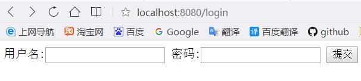
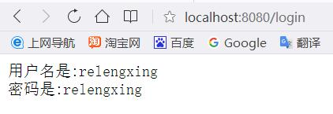

# SpringMvc学习笔记：数据绑定

这一篇学习如何获得请求中的数据，也就是数据绑定

首先看一下都有哪些绑定数据的注解：

1. @RequestParam，绑定单个请求数据，可以是URL中的数据，表单提交的数据或上传的文件；
2. @PathVariable，绑定URL模板变量值；
3. @CookieValue，绑定Cookie数据；
4. @RequestHeader，绑定请求头数据；
5. @ModelAttribute，绑定数据到Model；
6. @SessionAttributes，绑定数据到Session；
7. @RequestBody，用来处理Content-Type不是application/x-www-form-urlencoded编码的内容，例如application/json, application/xml等；
8. @RequestPart，绑定“multipart/data”数据，并可以根据数据类型进项对象转换；


### 示例1：获取用户名和密码
在文本框中输入用户名和密码，然后点击提交，提交的结果会在另外一个页面显示出来。
新建一个User类，如下：
```java
public class User {

    private String username;

    private String password;

    @Override
    public String toString() {
        return "User{" +
                "username='" + username + '\'' +
                ", password='" + password + '\'' +
                '}';
    }

    public String getUsername() {
        return username;
    }

    public void setUsername(String username) {
        this.username = username;
    }

    public String getPassword() {
        return password;
    }

    public void setPassword(String password) {
        this.password = password;
    }
}
```
新建一个LoginController
```java
@Controller
public class LoginController {

    @RequestMapping(value = "/login",method = RequestMethod.GET)
    public String login(){
        return "login";
    }

    @RequestMapping(value = "/login",method = RequestMethod.POST)
    public String login(Model model,User user){
        model.addAttribute("user",user);
        return "result";
    }
}
```
新建一个login.jsp
```jsp
<%@ page contentType="text/html;charset=UTF-8" language="java" %>
<html>
<head>
    <title>Login</title>
</head>
<body>
    <form action="/login" method="post">
        用户名:<input type="text" name="username"/>
        密码:<input type="text" name="password" />
        <input type="submit" value="提交"/>
    </form>
</body>
</html>
```
新建一个result.jsp
```jsp
<%@ page contentType="text/html;charset=UTF-8" language="java" %>
<html>
<head>
    <title>Result</title>
</head>
<body>
    用户名是:${user.username}
    <br />
    密码是:${user.password}
    <br />
</body>
</html>
```
运行：
首先是get方法访问login,返回的是login.jsp页面

然后输入用户名字和密码后按提交是post方法访问login，返回的是result.jsp，并把信息写入到页面中。


这是一个最典型的数据获取数据的示例。
