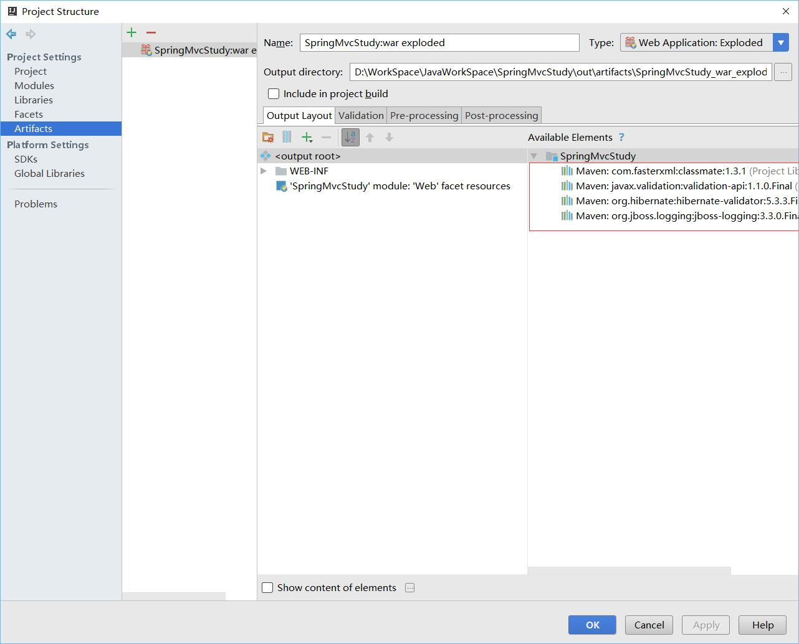
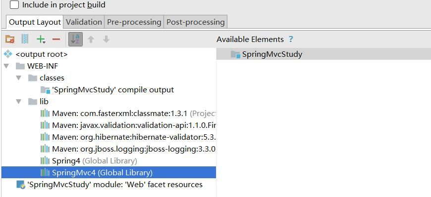

# SpringMvc学习笔记：数据验证

这里建工程使用Maven混合构建，有些东西需要自己补全。

数据验证有很多方式，这里写一种
JSR-303

先要导入两个包,是用Maven导入的。
```xml
    <dependencies>
        <dependency>
            <groupId>org.hibernate</groupId>
            <artifactId>hibernate-validator</artifactId>
            <version>5.3.3.Final</version>
        </dependency>
        <dependency>
            <groupId>javax.validation</groupId>
            <artifactId>validation-api</artifactId>
            <version>1.1.0.Final</version>
        </dependency>
    </dependencies>
```

这里有一个非常重要的注意事项
方框里面的要双击一下，不然到时候运行会报错。

双击以后架包会放入WEB-INF的lib目录下，不然以后运行的时候会出现类找不到的情况


### model
新建一个ValidateModel类
部分代码：
```java
@NotEmpty(message = "{name.not.empty}")
private String name;

@Range(min = 0,max = 150,message = "{age.not.inrange}")
private int age;

@NotEmpty(message = "{email.not.empty}")
@Email(message = "{email.not.correct}")
private String email;

```
这里如果不符合规则就会报Message里面的错误
剩下的代码就是get和set还有toString这种，手补或者脑补一下。
### 错误信息配置文件（未成功）
这一块看的资料上是这样的，但是我没有成功，所以这一块跳过
在resource文件夹下新建validatemessages.properties
内容如下：
```
name.not.empty="姓名不能为空"
age.not.inrange="年龄不在范围内"
email.not.correct="Email不正确"
email.not.empty="Email不能为空"
```
这里和Model文件中的message对应。单独新建一个配置文件的好处就是方便国际化。

### SpringMvc配置文件

```xml
<context:component-scan base-package="com.relengxing"/>
    <context:annotation-config/>
    <bean class="org.springframework.web.servlet.view.InternalResourceViewResolver">
        <property name="prefix" value="/WEB-INF/page/"/>
        <property name="suffix" value=".jsp"/>
    </bean>
    <mvc:annotation-driven validator="validator" conversion-service="conversion-service" />

    <bean id="validator" class="org.springframework.validation.beanvalidation.LocalValidatorFactoryBean">
        <property name="providerClass"  value="org.hibernate.validator.HibernateValidator"/>
        <!--不设置则默认为classpath下的 ValidationMessages.properties -->
        <property name="validationMessageSource" ref="validatemessageSource"/>
    </bean>
    <bean id="conversion-service" class="org.springframework.format.support.FormattingConversionServiceFactoryBean" />
    <bean id="validatemessageSource" class="org.springframework.context.support.ReloadableResourceBundleMessageSource">
        <property name="basename" value="validatemessages"/>
        <property name="fileEncodings" value="utf-8"/>
        <property name="cacheSeconds" value="120"/>
    </bean>
```
### controller
```java
@Controller
public class ValidateController {
    @RequestMapping(value = "/validate",method = RequestMethod.GET)
    public String validate(Model model){
        return "validate";
    }

    @RequestMapping(value = "/validate",method = RequestMethod.POST)
    public String validate(Model model, @Valid ValidateModel validateModel, BindingResult result){
        if (result.hasErrors()){
            List<ObjectError> errorList = result.getAllErrors();
            for(ObjectError error : errorList){
                System.out.println(error.getDefaultMessage());
            }
            return validate(model);
        }
        return "validateresult";
    }

}
```
这一块就是两个方法，一个响应GET,一个响应POST
注意POST的@Valid和BindingResult这两个参数要相邻，不然会报错。
### validate.jsp
```html
<%@ page contentType="text/html;charset=UTF-8" language="java" %>
<html>
<head>
    <title>Validate</title>
</head>
<body>
    ${error}
    <form action="/validate" method="post">
        姓名：<input type="text" name="name">
        年龄：<input type="number" name="age">
        邮箱：<input type="text" name="email">
        <input type="submit" value="提交">
    </form>
</body>
</html>
```
我这里用的全是Html的标签，没有使用Spring的标签。
如果出现错误，我这里也没有返回给前端页面了，就是在控制台输出一下。
如果成功会跳转到结果页面，结果页面就一行成功，这里就没写了，如果验证错误会回到登录页面。

这里能验证就行了，国际化的话以后在想想办法。
##　Validate注解
```
空检查
@Null       验证对象是否为null
@NotNull    验证对象是否不为null, 无法查检长度为0的字符串
@NotBlank 检查约束字符串是不是Null还有被Trim的长度是否大于0,只对字符串,且会去掉前后空格.
@NotEmpty 检查约束元素是否为NULL或者是EMPTY.

Booelan检查
@AssertTrue     验证 Boolean 对象是否为 true  
@AssertFalse    验证 Boolean 对象是否为 false  

长度检查
@Size(min=, max=) 验证对象（Array,Collection,Map,String）长度是否在给定的范围之内  
@Length(min=, max=) Validates that the annotated string is between min and max included.

日期检查
@Past       验证 Date 和 Calendar 对象是否在当前时间之前  
@Future     验证 Date 和 Calendar 对象是否在当前时间之后  
@Pattern    验证 String 对象是否符合正则表达式的规则

数值检查，建议使用在Stirng,Integer类型，不建议使用在int类型上，因为表单值为“”时无法转换为int，但可以转换为Stirng为"",Integer为null
@Min        验证 Number 和 String 对象是否大等于指定的值  
@Max        验证 Number 和 String 对象是否小等于指定的值  
@DecimalMax 被标注的值必须不大于约束中指定的最大值. 这个约束的参数是一个通过BigDecimal定义的最大值的字符串表示.小数存在精度
@DecimalMin 被标注的值必须不小于约束中指定的最小值. 这个约束的参数是一个通过BigDecimal定义的最小值的字符串表示.小数存在精度
@Digits     验证 Number 和 String 的构成是否合法  
@Digits(integer=,fraction=) 验证字符串是否是符合指定格式的数字，interger指定整数精度，fraction指定小数精度。

@Range(min=, max=) Checks whether the annotated value lies between (inclusive) the specified minimum and maximum.
@Range(min=10000,max=50000,message="range.bean.wage")
private BigDecimal wage;

@Valid 递归的对关联对象进行校验, 如果关联对象是个集合或者数组,那么对其中的元素进行递归校验,如果是一个map,则对其中的值部分进行校验.(是否进行递归验证)
@CreditCardNumber信用卡验证
@Email  验证是否是邮件地址，如果为null,不进行验证，算通过验证。
@ScriptAssert(lang= ,script=, alias=)
@URL(protocol=,host=, port=,regexp=, flags=)

```
