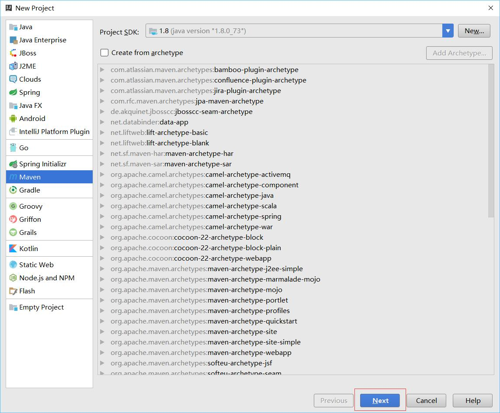
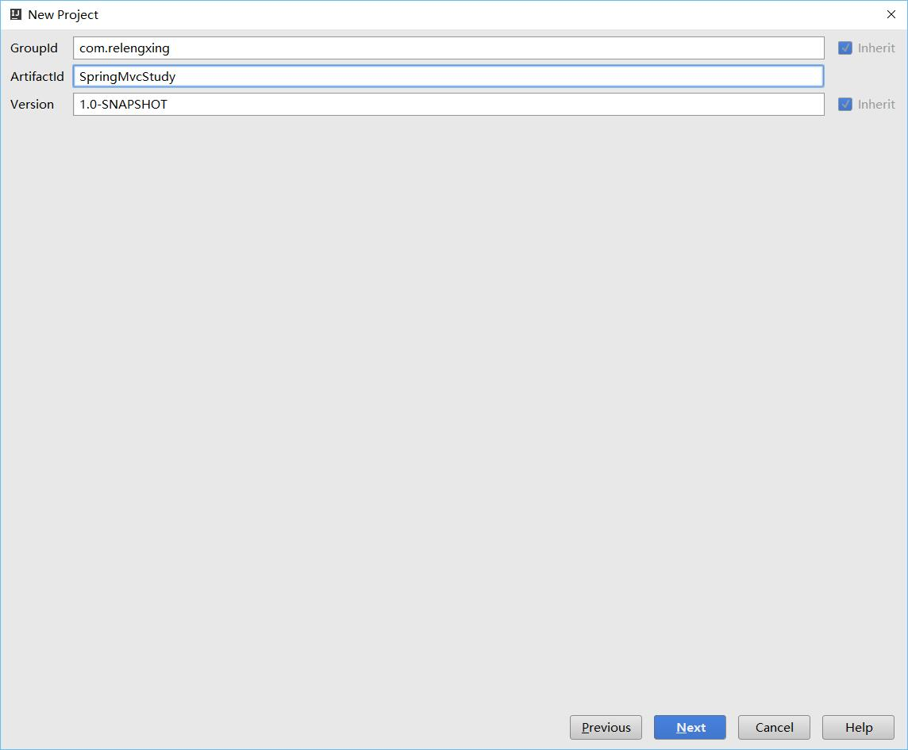
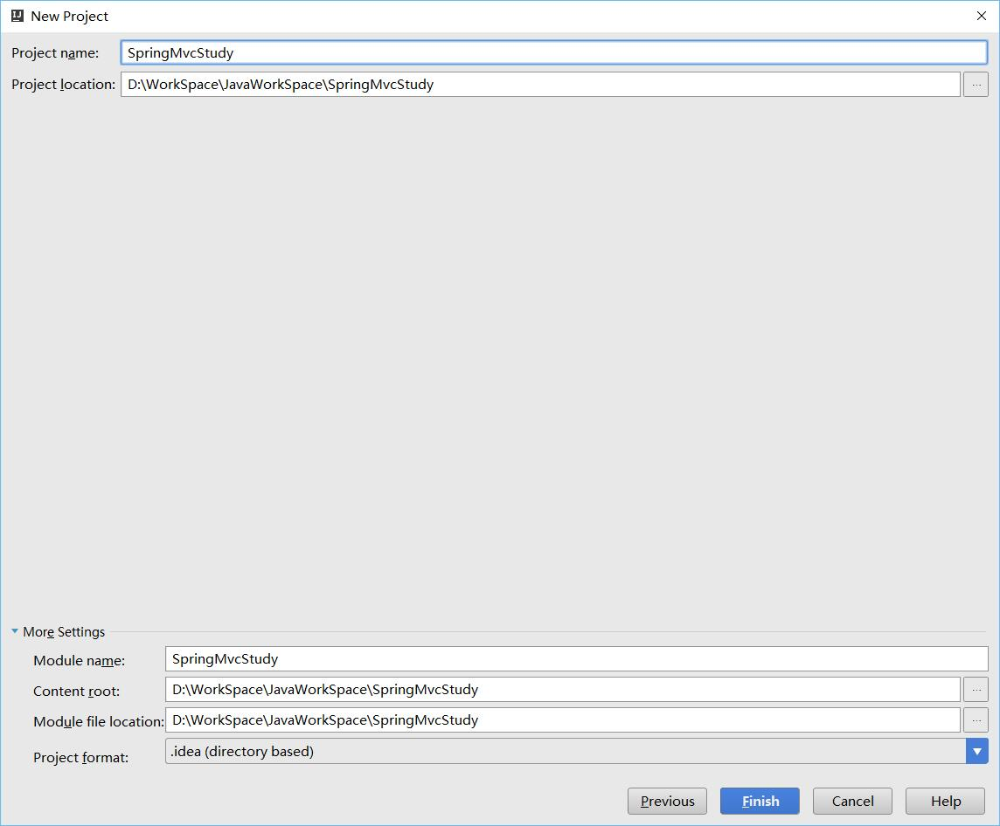
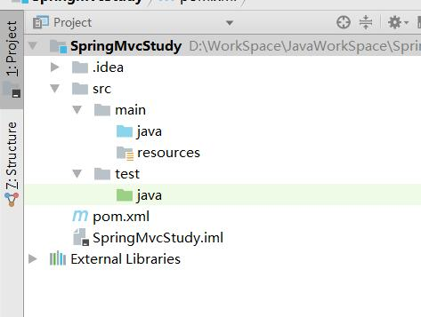
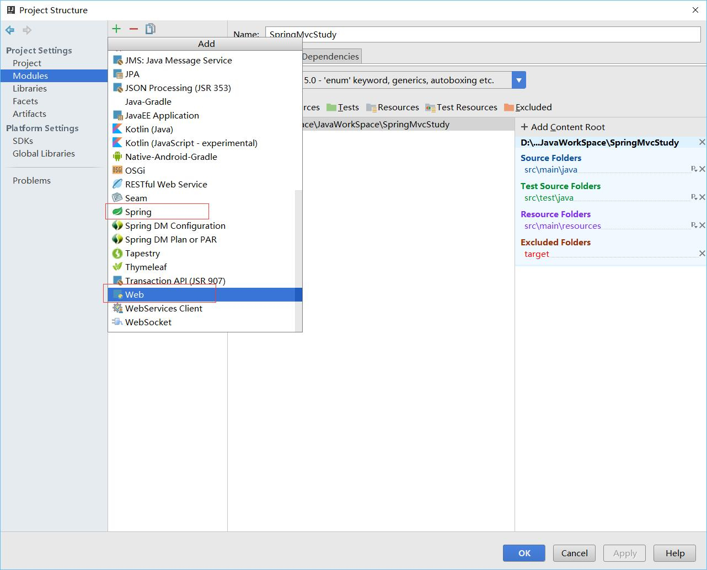
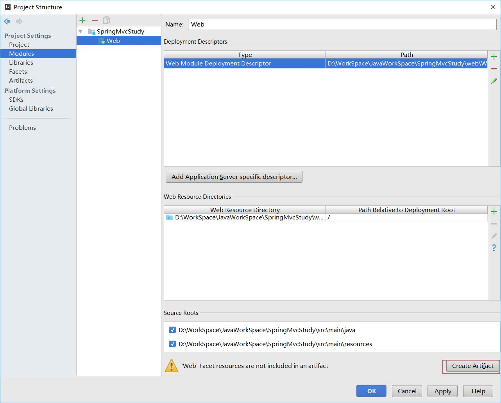

# SpringMvc学习笔记：数据验证
之前新建工程是直接用idea的SpringMvc，这里使用idea的maven新建工程，然后再导入SpringMvc的架包

这里添加完Spring后再添加SpringMvc

我这里为什么这样做，而不是直接用pom来管理，因为Spring文件太多了，一个一个手动添加不方便，我就直接用idea的了，其他的单个的就使用Maven来管理。
后面的就和HelloWorld那篇大同小异了。
这样做的缺点也明显，就是Spring的版本管理不是使用的Pom。一句话就是活人不能让尿憋死，这里主要为了学习，怎么方便怎么来，实际项目中应该使用maven完整的进行版本管理。
