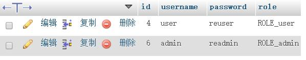

# SpringSecurity学习笔记：自定义验证方式

我们存密码到数据库不可能是明文的，肯定要加密，一般会使用md5加盐再加密

我这里只加盐，就不用md5加密了

## 新建工程
工程和上一篇基本上一样，偷懒就直接用上一篇的，
这里又新建一个工程，把上一篇的东西都复制过来，然后再修改


## 代码
代码和上篇差不多
修改 UserService.java
```java
package com.relengxing.service;

import com.relengxing.dao.UserRepository;
import com.relengxing.entity.User;
import org.springframework.beans.factory.annotation.Autowired;
import org.springframework.security.core.authority.SimpleGrantedAuthority;
import org.springframework.security.core.userdetails.UserDetails;
import org.springframework.security.core.userdetails.UserDetailsService;
import org.springframework.security.core.userdetails.UsernameNotFoundException;
import org.springframework.stereotype.Service;

import java.util.ArrayList;
import java.util.List;

/**
 * Created by relengxing on 2017/1/5.
 */
@Service
public class UserService implements UserDetailsService {

    @Autowired
    UserRepository userRepository;
    @Override
    public UserDetails loadUserByUsername(String s) throws UsernameNotFoundException {
        User user = userRepository.findByUsername(s);
        if (user == null){
            throw new UsernameNotFoundException(String.format("User with username=%s was not found", s));
        }
        MyUserDetails details = new MyUserDetails(user);
        return details;
    }
}

```
修改SecurityConfig.java
增加一个自定义验证
```java
package com.relengxing.config;

import com.relengxing.service.MyAuthenticationProvider;
import com.relengxing.service.UserService;
import org.springframework.beans.factory.annotation.Autowired;
import org.springframework.context.annotation.Configuration;
import org.springframework.security.config.annotation.authentication.builders.AuthenticationManagerBuilder;
import org.springframework.security.config.annotation.method.configuration.EnableGlobalMethodSecurity;
import org.springframework.security.config.annotation.web.builders.HttpSecurity;
import org.springframework.security.config.annotation.web.configuration.EnableWebSecurity;
import org.springframework.security.config.annotation.web.configuration.WebSecurityConfigurerAdapter;

/**
 * Created by relengxing on 2017/1/5.
 */
@Configuration
@EnableWebSecurity
@EnableGlobalMethodSecurity(prePostEnabled = true)
public class SecurityConfig extends WebSecurityConfigurerAdapter {

    @Autowired
    private MyAuthenticationProvider provider;
    @Override
    protected void configure(AuthenticationManagerBuilder auth) throws Exception {
        auth.authenticationProvider(provider);
    }

    @Override
    protected void configure(HttpSecurity http) throws Exception {
        http
                .authorizeRequests()
                // 例如以下代码指定了/和/index不需要任何认证就可以访问，其他的路径都必须通过身份验证。
                .antMatchers("/", "/index").permitAll()
                .anyRequest().authenticated()
                .and()
                //通过formLogin()定义当需要用户登录时候，转到的登录页面。
                .formLogin()
                .loginPage("/login")
                .permitAll()
                .and()
                //注销
                .logout()
                .permitAll();
        //关闭csrf 防止循环定向
        http.csrf().disable();
    }
}
```
新增MyAuthenticationProvider.java
```java
package com.relengxing.service;

import org.springframework.beans.factory.annotation.Autowired;
import org.springframework.security.authentication.AuthenticationProvider;
import org.springframework.security.authentication.BadCredentialsException;
import org.springframework.security.authentication.UsernamePasswordAuthenticationToken;
import org.springframework.security.core.Authentication;
import org.springframework.security.core.AuthenticationException;
import org.springframework.security.core.GrantedAuthority;
import org.springframework.stereotype.Service;

import java.util.Collection;

/**
 * Created by relengxing on 2017/1/5.
 */
@Service
public class MyAuthenticationProvider implements AuthenticationProvider {

    @Autowired
    UserService userService;


    @Override
    public Authentication authenticate(Authentication authentication) throws AuthenticationException {
        String username = authentication.getName();
        String password = (String) authentication.getCredentials();
        MyUserDetails user = (MyUserDetails) userService.loadUserByUsername(username);
        if(user == null){
            throw new BadCredentialsException("Username not found.");
        }
        //加密过程在这里体现
        password = "re"+password;
        if (!password.equals(user.getPassword())) {
            throw new BadCredentialsException("Wrong password.");
        }
        Collection<? extends GrantedAuthority> authorities = user.getAuthorities();
        return new UsernamePasswordAuthenticationToken(user, password, authorities);
    }

    @Override
    public boolean supports(Class<?> aClass) {
        return true;
    }
}

```
新增MyUserDetails.java
```java
package com.relengxing.service;

import com.relengxing.entity.User;
import org.springframework.security.core.GrantedAuthority;
import org.springframework.security.core.authority.SimpleGrantedAuthority;
import org.springframework.security.core.userdetails.UserDetails;

import java.util.Arrays;
import java.util.Collection;

/**
 * Created by relengxing on 2017/1/5.
 */
public class MyUserDetails implements UserDetails {

    private User user;

    public MyUserDetails(User user) {
        this.user = user;
    }

    @Override
    public Collection<? extends GrantedAuthority> getAuthorities() {
        return Arrays.asList(new SimpleGrantedAuthority(user.getRole()));
    }

    @Override
    public String getPassword() {
        return user.getPassword();
    }

    @Override
    public String getUsername() {
        return user.getUsername();
    }

    @Override
    public boolean isAccountNonExpired() {
        return true;
    }

    @Override
    public boolean isAccountNonLocked() {
        return true;
    }

    @Override
    public boolean isCredentialsNonExpired() {
        return true;
    }

    @Override
    public boolean isEnabled() {
        return true;
    }
}
```

注意看数据库的内容
例如，user的帐号是`user`,密码是`reuser`
在自定义验证的代码中
```java
password = "re"+password;
```
也就是说程序会给接收到的密码前面加re
现在登录的时候，user的帐号密码都是user
admin的帐号密码都是admin
这里不演示了。
同样这里可以换成md5或者其他加密。
