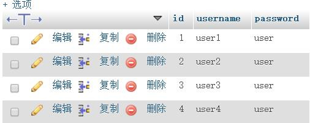
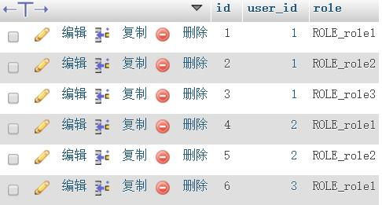

# SpringSecurity学习笔记：多角色


这篇在上篇的基础上改

有时候一个用户对应的不是一个角色，而是多个角色，比如
user1有role1,role2,role3三个角色    
user2有role1,role2两个角色
user3有role1这一个角色    

所以数据库就需要就该了
这是一个多对多的关系，理论上需要三张表
一张user表，里面记录username和password
一张role表
一张关联表，然后关联user和role的id    

我这里偷个懒，就两张表，一个user表，一个关联表，
user表    

role表    


新建几个页面
内容随意,大致如下
```html
<!DOCTYPE html>
<html lang="en" xmlns:th="http://www.w3.org/1999/xhtml">
<head>
    <meta charset="UTF-8"/>
    <title>user1</title>
</head>
<body>
user1页面
<p><a th:href="@{/user1}">前往user1界面</a></p>
<p><a th:href="@{/user2}">前往user2界面</a></p>
<p><a th:href="@{/user3}">前往user3界面</a></p>
</body>
</html>
```
添加controller
```java
@RequestMapping(value = "/user1",method = RequestMethod.GET)
@PreAuthorize("hasRole('role1')")
public String user1(){
    return "user1";
}

@RequestMapping(value = "/user2",method = RequestMethod.GET)
@PreAuthorize("hasRole('role2')")
public String user2(){
    return "user2";
}

@RequestMapping(value = "/user3",method = RequestMethod.GET)
@PreAuthorize("hasRole('role3')")
public String user3(){
    return "user3";
}
```

然后上篇的User类得删了。重新生成两个Entity，自动生成的，我这里不贴了，需要的话看源码。  
这里没有做实体类的多对一关联，就是分开的。

role类的dao
```java
public interface RoleRepository extends JpaRepository<Role,Integer> {
    List<Role> findByuserId(int id);
}
```
MyAuthenticationProvider这个类的加盐加密删了，没有使用


MyUserDetails.java修改如下
```java
package com.relengxing.service;

import com.relengxing.entity.Role;
import com.relengxing.entity.User;
import org.springframework.security.core.GrantedAuthority;
import org.springframework.security.core.authority.AuthorityUtils;
import org.springframework.security.core.authority.SimpleGrantedAuthority;
import org.springframework.security.core.userdetails.UserDetails;

import java.util.Arrays;
import java.util.Collection;
import java.util.List;

/**
 * Created by relengxing on 2017/1/5.
 */
public class MyUserDetails implements UserDetails {

    private User user;
    private List<Role> roles;
    public MyUserDetails(User user, List<Role> roles) {
        this.user = user;
        this.roles = roles;
    }

    @Override
    public Collection<? extends GrantedAuthority> getAuthorities() {
        StringBuilder builder = new StringBuilder();
        for ( Role role :
            roles) {
            builder.append(role.getRole()).append(",");
        }
        String authorities = builder.substring(0,builder.length()-1);
        return AuthorityUtils.commaSeparatedStringToAuthorityList(authorities);
    }

    @Override
    public String getPassword() {
        return user.getPassword();
    }

    @Override
    public String getUsername() {
        return user.getUsername();
    }

    @Override
    public boolean isAccountNonExpired() {
        return true;
    }

    @Override
    public boolean isAccountNonLocked() {
        return true;
    }

    @Override
    public boolean isCredentialsNonExpired() {
        return true;
    }

    @Override
    public boolean isEnabled() {
        return true;
    }
}

```
主要是修改了getAuthorities这个方法，把角色从数据库取出来然后return出去了。
UserService修改如下

```java
package com.relengxing.service;

import com.relengxing.dao.RoleRepository;
import com.relengxing.dao.UserRepository;
import com.relengxing.entity.Role;
import com.relengxing.entity.User;
import org.springframework.beans.factory.annotation.Autowired;
import org.springframework.security.core.userdetails.UserDetails;
import org.springframework.security.core.userdetails.UserDetailsService;
import org.springframework.security.core.userdetails.UsernameNotFoundException;
import org.springframework.stereotype.Service;

import java.util.List;

/**
 * Created by relengxing on 2017/1/5.
 */
@Service
public class UserService implements UserDetailsService {

    @Autowired
    UserRepository userRepository;

    @Autowired
    RoleRepository roleRepository;
    @Override
    public UserDetails loadUserByUsername(String s) throws UsernameNotFoundException {
        User user = userRepository.findByUsername(s);
        List<Role> list = roleRepository.findByuserId(user.getId());
        if (user == null){
            throw new UsernameNotFoundException(String.format("User with username=%s was not found", s));
        }
        MyUserDetails details = new MyUserDetails(user,list);
        return details;
    }
}
```
这里就是对应上面的修改一下，把权限取出来传进去


实验结果不贴图了。
就是user1可以访问user1页面，user2页面，user2页面
user2能访问user1页面，user2页面
user3只能访问user1页面。


多角色就在于数据库要设计好，然后getAuthorities这个方法改好就可以了。
