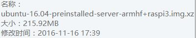
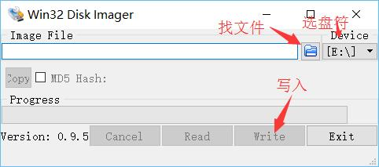
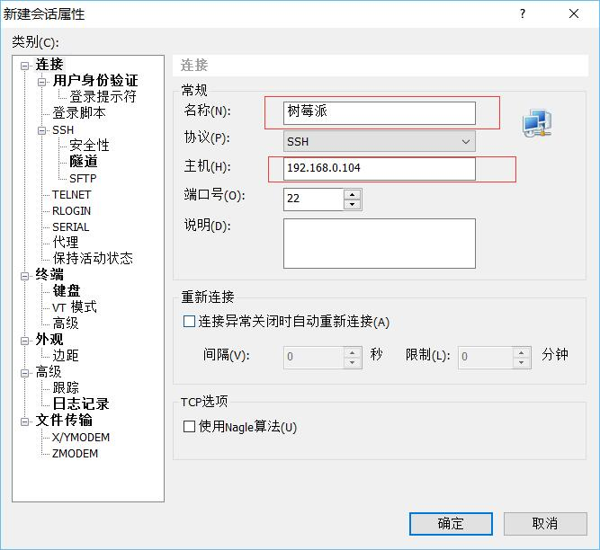
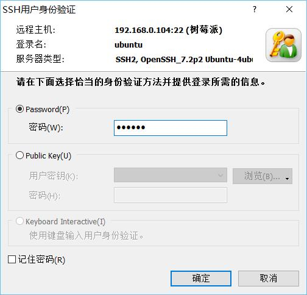
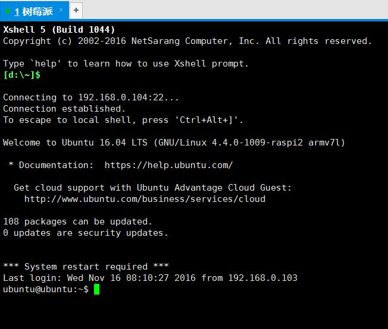

# re冷星的技术博客Linux篇：树莓派开发环境搭建

前段时间租了三个月阿里云，感觉太贵了，就买了个树莓派3，准备搭建一个linux操作系统，当服务器用用，大概花费不到300。电源5V×2.5A，一般情况下不用这么高的电流，功耗其实很低的。

组装就不说了。。成品如下

几个要下载的东西:
链接：http://pan.baidu.com/s/1o8FC0xO 密码：psww
这个是系统

把他解压出来是一个.img文件。

这个软件安装一下。
`Win32DiskImager-0.9.5-install.exe`
内存卡，读卡器准备好
内存卡===插进=3  读卡器  ===插进=3 电脑
这一步够形象了吧
然后就写到系统里面

写完以后就可以插到树莓派上了，网线端接路由器的LAN口，电脑和树莓派在同一个局域网下。
上电，等开好机

在路由器管理页面下可以找到
我的是 192.168.0.104

然后就可以用xshell连接了

然后就登录成功了
我这里是用有线连接的，无线的没有去做了

OK,大功告成，然后可以开始装各种软件的开发环境了。
