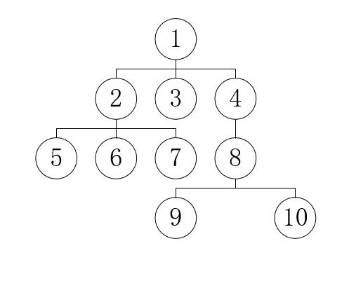

# 数据结构和算法：树

### 基本概念
树就长下面这个形状
一个节点出发，下面是子节点，只能有一个老爹，但是可以有多个儿子

1. 结点的度
      结点的度是子结点的个数。例如：结点1有三个字结点2，3，4，所以结点1的度为3。
2. 树的度
      树的度等于所有结点度中度最高的值。例如：上图中结点度最高为3，所以树的度为3。
3. 叶子结点
      叶子结点是度为0的结点即没有子结点的结点。例如：上图中3，5，6，7，9，10。
4. 分支结点
      分支结点是除了叶子结点，树中的其他所有结点。例如：上面树的分支结点为1，2，4，8。
5. 内部结点
      内部结点是除了根结点以及叶子结点或在分支结点的基础之上在去掉根结点。例如：上面树的内部结点为2，4，8。
6. 父结点、子结点、兄弟结点
     父节点、子结点和兄弟结点是相对而言的。例如：结点1是结点2，3，4的父节点，结点2，3，4也是结点1的子结点，结点2，3，4又是兄弟结点。
7. 层次
     图中我们已经表出来了，根为第一层，根的孩子为第二层，依此类推，若某结点在第i层，则其孩子结点在第i+1层。

### 树的遍历
1. 前序遍历
      基本思想：前序遍历就是先访问根结点，再访问叶子结点。
      图中树的前序遍历为：1，2，5，6，7，3，4，8，9，10。
2. 后序遍历
基本思想：本后序遍历就是先访问子结点，再访问根结点。
      图中树的后序遍历为：5，6，7，2，3，9，10，8，4，1。
3. 层次遍历
     基本思想：从第一层开始，依此遍历每层，直到结束。
     图中树的层次遍历为：1，2，3，4，5，6，7，8，9，10。

## 二叉树
二叉树是每个节点最多有两个子树的树结构。通常子树被称作“左子树”（left subtree）和“右子树”（right subtree）

>二叉树的每个结点至多只有二棵子树(不存在度大于2的结点)，二叉树的子树有左右之分，次序不能颠倒。二叉树的第i层至多有2^{i-1}个结点；深度为k的二叉树至多有2^k-1个结点；对任何一棵二叉树T，如果其终端结点数为n_0，度为2的结点数为n_2，则n_0=n_2+1。
一棵深度为k，且有2^k-1个节点称之为满二叉树；深度为k，有n个节点的二叉树，当且仅当其每一个节点都与深度为k的满二叉树中，序号为1至n的节点对应时，称之为完全二叉树。

### 类型
1. 完全二叉树——若设二叉树的高度为h，除第 h 层外，其它各层 (1～h-1) 的结点数都达到最大个数，第h层有叶子结点，并且叶子结点都是从左到右依次排布，这就是完全二叉树。
2. 满二叉树——除了叶结点外每一个结点都有左右子叶且叶子结点都处在最底层的二叉树。
3. 平衡二叉树——平衡二叉树又被称为AVL树（区别于AVL算法），它是一棵二叉排序树，且具有以下性质：它是一棵空树或它的左右两个子树的高度差的绝对值不超过1，并且左右两个子树都是一棵平衡二叉树。

二叉树不是树的一种特殊情形，尽管其与树有许多相似之处，但树和二叉树有两个主要差别：
1. 树中结点的最大度数没有限制，而二叉树结点的最大度数为2；
2. 树的结点无左、右之分，而二叉树的结点有左、右之分
