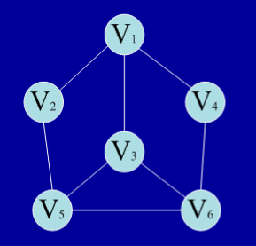

# 数据结构和算法：图

### 基本概念
形如下图的就是图。。
树具有层次关系，上层元素可以与下一个多个元素连接，但是只能和上层的一个元素连接。在图结构中，节点间的连接是任意的，任何一个元素都可以与其他元素连接。

### 遍历
概念：从图中某一个顶点出发，访问图中的每一个结点，并要求只能访问一次，不能重复访问。

（1）广度优先遍历
       基本思想：首先访问顶点，再访问顶点的全部未访问的邻结点，再访问邻结点的所有结点即可（类似树的层次遍历）。
       广度优先遍历：V1，V2，V3，V4，V5，V6或V1，V4，V3，V2，V6，V5
（2）深度优先遍历
       基本思想：首先访问顶点，再访问顶点的每个邻结点，从该点继续深度优先遍历（类似于树的前序遍历）
       深度优先遍历：V1，V2，V5，V3，V6，V4或V1，V4，V6，V3，V5，V2

总结，图的广度优先遍历和深度优先遍历的结果并不唯一。
